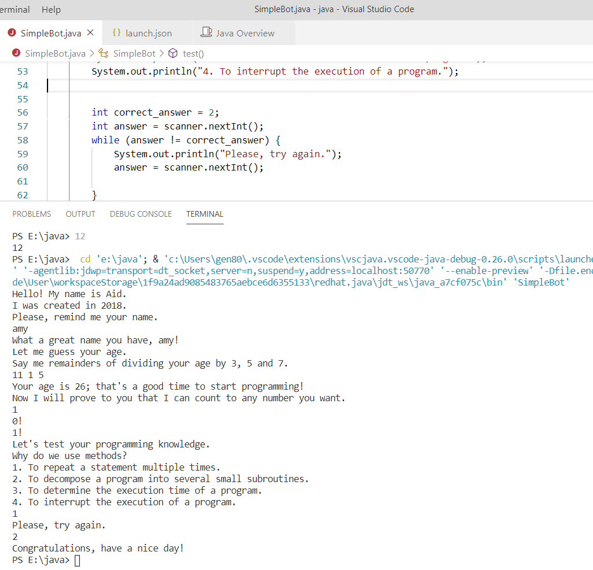

# Learn and apply Java basic syntax through project Simple Chatty Bot
This is a guided project in the Java introduction course offered by [JetBrains Academy](https://www.jetbrains.com/academy/)

## Project: Simple Chatty Bot

Finished code that are run and debugged in VS Code console:
```
import java.util.Scanner;

public class SimpleBot {
    final static Scanner scanner = new Scanner(System.in); 

    public static void main(String[] args) {
        greet("Aid", "2018"); 
        remindName();
        guessAge();
        count();
        test();
        end();
    }

    static void greet(String assistantName, String birthYear) {
        System.out.println("Hello! My name is " + assistantName + ".");
        System.out.println("I was created in " + birthYear + ".");
        System.out.println("Please, remind me your name.");
    }

    static void remindName() {
        String name = scanner.nextLine();
        System.out.println("What a great name you have, " + name + "!");
    }

    static void guessAge() {
        System.out.println("Let me guess your age.");
        System.out.println("Say me remainders of dividing your age by 3, 5 and 7.");
        int rem3 = scanner.nextInt();
        int rem5 = scanner.nextInt();
        int rem7 = scanner.nextInt();
        int age = (rem3 * 70 + rem5 * 21 + rem7 * 15) % 105;
        System.out.println("Your age is " + age + "; that's a good time to start programming!");
    }

    static void count() {
        System.out.println("Now I will prove to you that I can count to any number you want.");
        int num = scanner.nextInt();
        for (int i = 0; i <= num; i++) {
            System.out.printf("%d!\n", i);
        }
    }

    static void test() {
        System.out.println("Let's test your programming knowledge.");
        
        System.out.println("Why do we use methods?");
        System.out.println("1. To repeat a statement multiple times.");
        System.out.println("2. To decompose a program into several small subroutines.");
        System.out.println("3. To determine the execution time of a program.");
        System.out.println("4. To interrupt the execution of a program.");


        int correct_answer = 2;
        int answer = scanner.nextInt();
        while (answer != correct_answer) {
            System.out.println("Please, try again.");
            answer = scanner.nextInt();
            
        }
        
    }

    static void end() {
        System.out.println("Congratulations, have a nice day!"); 
    }
}

```

# Running result


