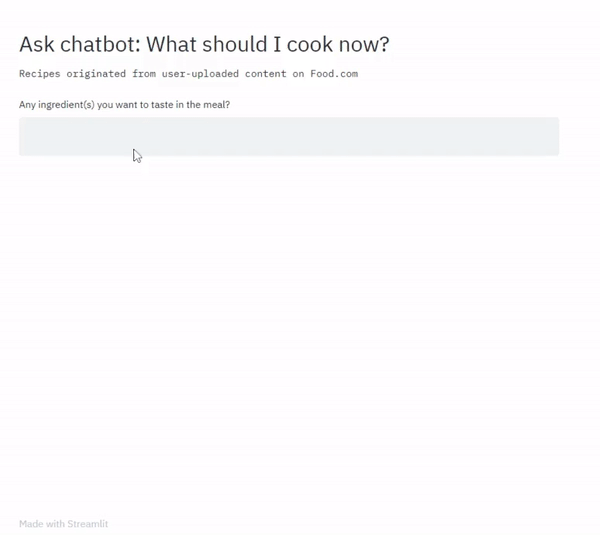

## Latest personal project highlights:

###  Food Recipe query bot 
- solve a common daily problem with rules-based chatbot by querying a recipe dataframe

[source code](https://github.com/Amyylam/sentimentscale/blob/master/recipe_bot.ipynb)

- sister streamlit app now up and running on http://recipe-query-bot.herokuapp.com/!

[source_code](https://github.com/Amyylam/sentimentscale/blob/master/recipe_bot_app.py)

New add-on! - [speech recognition mode app source code](https://github.com/Amyylam/sentimentscale/blob/master/recipe_bot_app_audiomode.py)

](https://youtu.be/Ae2fZu4opic)

###  [Guided project: Learn Java syntax through SimpleBot project](https://github.com/Amyylam/sentimentscale/blob/master/Learn%20Java%20syntax%20through%20project%20SimpleBot.md)

###  Business Sentiment Analyzer: a streamlit app for making sentiment analyzer predictions
-	Deployed a finetuned text classifier from pretrained BERT embeddings to a frontend web application. User can input a news headline or a CSV of headlines to make inferences.

[code file](https://github.com/Amyylam/sentimentscale/blob/master/flair_make_predictions_app.py)

####  [Webscrapping emotion reactions to news articles on HK01.com](https://github.com/Amyylam/sentimentscale/blob/master/emo_count_corpus.py)
- To collect emoji comments as distant supervised sentiment label on news articles for downstream training of news sentiment analysis model 

####  [Guided project - Using Sqlite and Pandas on Large Data](https://github.com/Amyylam/sentimentscale/blob/master/guided_project_large_data_handling/Using_Sqlite_Pandas_on_Large_Data.ipynb)
- Analyze Startup Fundraising Deals from Crunchbase (Dataquest.com Course Mission 167)

## Earlier machine learning model/visualization experiments:

	[Sentiment Analysis of US President Donald Trump’s tweet on Chinese Equities](https://github.com/Amyylam/sentimentscale/blob/master/sentiment_analysis_trial.ipynb)
-	Used stock market reaction as distant supervision of positive/negative sentiment to analyze A collection and manual annotations of >300 tweets from Mr. Trump about ‘China’. Trained machine learning models including Naïve Bayes and Logistic Regression, best test set prediction accuracy at 0.65.

	[CNN Greed and Fear Index 3-year Backtrack Analysis](https://github.com/Amyylam/sentimentscale/blob/master/CNNGreedIndex_3yr_backtrack.ipynb)
-	 Explored and visualized how the composite investor sentiment barometer correlates with stock market performance, and what ensued after extreme positive/negative readings.

	[Dow Jones Index Up/Down Ratio Sentiment Track](https://github.com/Amyylam/sentimentscale/blob/master/UpDown_ratio_sentiment_track.ipynb)
-	 Visualized most frequent words in retail investors’ tweets when stocks rally/plummet

